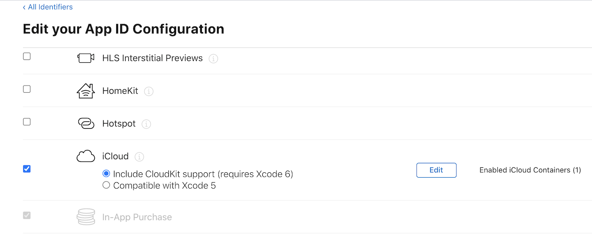
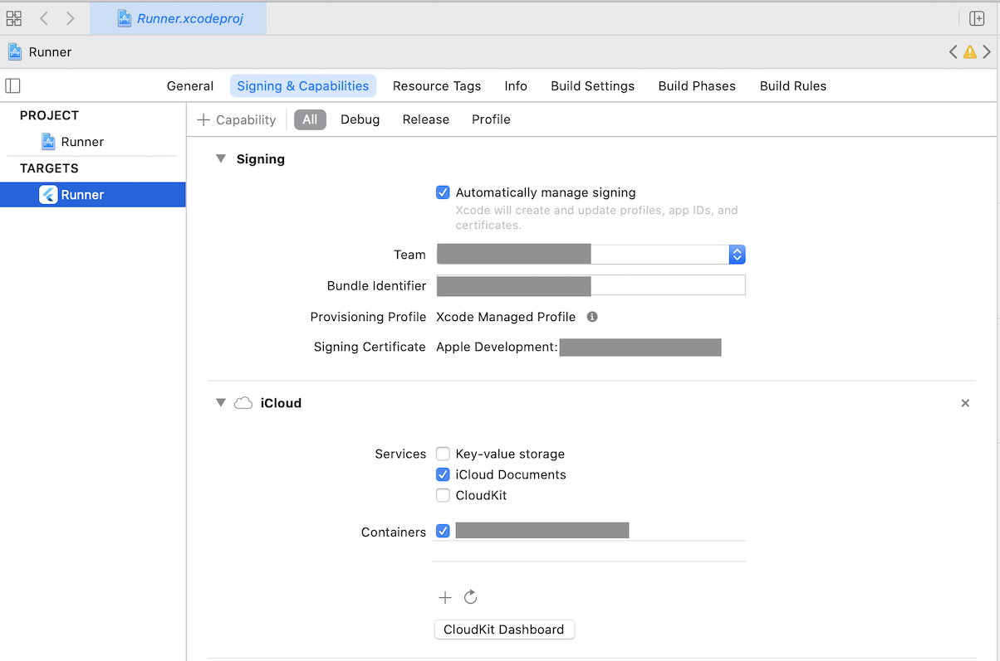

# icloud_storage

[](https://pub.dev/packages/icloud_storage)
[](https://www.paypal.com/donate?hosted_button_id=BH6WBSGWN594U)

A flutter plugin for uploading and downloading files to and from iCloud.

## Introduction

Documents and other data that is user-generated and stored in the <Application_Home>/Documents directory can be automatically backed up by iCloud on iOS devices, if the iCloud Backup setting is turned on. The data can be recovered when user sets up a new device or resets an existing device. If you need to do backup and download outside the forementioned scenarios, this plugin could help.

## Prerequisite

The following setups are needed in order to use this plugin:

1. An apple developer account
2. Created an App ID and iCloud Container ID
3. Enabled iCloud capability and assigned iCloud Container ID for the App ID
4. Enabled iCloud capability in Xcode

Refer to the [How to set up iCloud Container and enable the capability](#how-to-set-up-icloud-container-and-enable-the-capability) section for more detailed instructions.

## API Usage

### Get instance

```dart
final iCloudStorage = await ICloudStorage.getInstance('iCloudContainerId');
```

### Gather files from iCloud

```dart
final fileList = await iCloudStorage.gatherFiles(onUpdate: (stream) {
  filesUpdateSub = stream.listen((updatedFileList) {
    print('FILES UPDATED');
    updatedFileList.forEach((file) => print('-- ${file.relativePath}'));
  });
});
print('FILES GATHERED');
fileList.forEach((file) => print('-- ${file.relativePath}'));
```

### Upload a file to iCloud

```dart
await iCloudStorage.startUpload(
  filePath: '/localDir/localFile',
  destinationRelativePath: 'destDir/destFile',
  onProgress: (stream) {
    uploadProgressSub = stream.listen(
      (progress) => print('Upload File Progress: $progress'),
      onDone: () => print('Upload File Done'),
      onError: (err) => print('Upload File Error: $err'),
      cancelOnError: true,
    );
  },
);
```

Note: The 'startUpload' API is to start the upload process. The returned future completes without waiting for the upload to complete. Use 'onProgress' to track the upload progress. If the 'destinationRelativePath' contains a subdirectory that doesn't exist, it will be created.

### Download a file from iCloud

```dart
await iCloudStorage.startDownload(
  relativePath: 'relativePath',
  destinationFilePath: '/localDir/localFile',
  onProgress: (stream) {
    downloadProgressSub = stream.listen(
      (progress) => print('Download File Progress: $progress'),
      onDone: () => print('Download File Done'),
      onError: (err) => print('Download File Error: $err'),
      cancelOnError: true,
    );
  },
);
```

Note: The 'startDownload' API is to start the download process. The returned future completes without waiting for the download to complete. Use 'onProgress' to track the download progress.

### Delete a file from iCloud

```dart
await iCloudStorage.delete('relativePath');
```

### Move a file from one location to another

```dart
await iCloudStorage.move(
  fromRelativePath: 'dir/file',
  toRelativePath: 'dir/subdir/file',
);
```

### Rename a file

```dart
await iCloudStorage.rename(
  relativePath: 'relativePath',
  newName: 'newName',
);
```

### Error handling

```dart
catch (err) {
  if (err is PlatformException) {
    if (err.code == PlatformExceptionCode.iCloudConnectionOrPermission) {
      print(
          'Platform Exception: iCloud container ID is not valid, or user is not signed in for iCloud, or user denied iCloud permission for this app');
    } else if (err.code == PlatformExceptionCode.fileNotFound) {
      print('File not found');
    } else {
      print('Platform Exception: ${err.message}; Details: ${err.details}');
    }
  } else {
    print(err.toString());
  }
}
```

## Migrating from version 0.x.x to 1.x.x

- 'startUpload': rename 'destinationFileName' to 'destinationRelativePath'.
- 'startDownload': rename 'fileName' to 'relativePath'.

## FAQ

Q: I uploaded a file from a device. I signed in to a simulator using the same iCloud account. But the file is not showing up in the gatherFiles result.

A: From the menu 'Features' click 'Tigger iCloud Sync'.

Q: I uploaded a file from device A. I signed in to device B using the same iCloud account. But the file is not showing up in the gatherFiles result.

A: The API only queries files that's been synced to the iCloud container, which lives in the local device. You'll need to wait for iOS to sync the files from iCloud to the local container. There's no way to programmatically trigger iOS to Sync with iCloud.

Q: I removed a file using 'delete' method then called 'gatherFiles'. The deleted file still shows up in the list.

A: This is most likely to be an issue with the native code. However, if you call 'gatherFiles' first and listen the update, then do the deletion, the list is refreshed immediately in the onUpdate stream.

## How to set up iCloud Container and enable the capability

1. Log in to your apple developer account and select 'Certificates, IDs & Profiles' from the left navigation.
2. Select 'Identifiers' from the 'Certificates, IDs & Profiles' page, create an App ID if you haven't done so, and create an iCloud Containers ID.
   
3. Click on your App ID. In the Capabilities section, select 'iCloud' and assign the iCloud Container created in step 2 to this App ID.
   
4. Open your project in Xcode. Set your App ID as 'Bundle Identifier' if you haven't done so. Click on '+ Capability' button, select iCloud, then tick 'iCloud Documents' in the Services section and select your iCloud container.
   

## References

[Apple Documentation - iOS Data Storage Guidelines](https://developer.apple.com/icloud/documentation/data-storage/)

[Apple Documentation - Designing for Documents in iCloud](https://developer.apple.com/library/archive/documentation/General/Conceptual/iCloudDesignGuide/Chapters/DesigningForDocumentsIniCloud.html)
